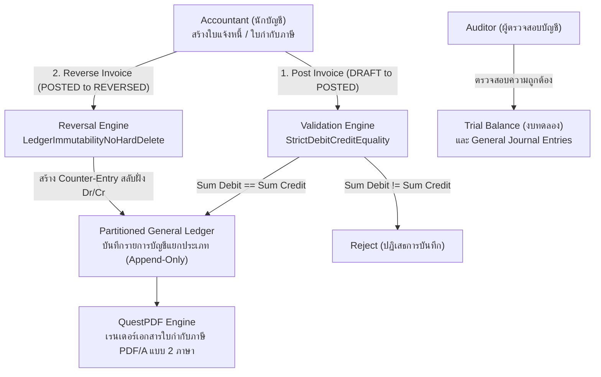
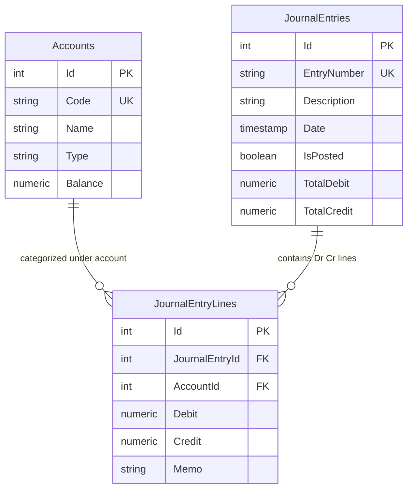

# 02_ACCOUNTING_ENGINE: Enterprise Double-Entry Accounting Engine

ระบบบัญชีคู่ (Double-Entry General Ledger) ระดับองค์กร ออกแบบตามมาตรฐานการบัญชีสากล พร้อมระบบบันทึกสมุดบัญชีแยกประเภทแบบ Immutable (ห้ามลบเด็ดขาด) และเครื่องมือสร้างใบกำกับภาษี/ใบเสร็จรับเงิน PDF/A มาตรฐานกรมสรรพากร

---

## 🔄 ภาพรวม Workflow การทำงาน (Business & Technical Workflow)



### รายละเอียดขั้นตอนการเปลี่ยนสถานะ (State Transitions):
1. **`DRAFT ➔ POSTED` (Trigger: `POST_INVOICE`)**:
   - นักบัญชีกรอกรายการใบแจ้งหนี้และบัญชีคู่ (ลูกหนี้การค้า, รายได้จากการขาย, ภาษีขาย)
   - ระบบตรวจสอบความสมดุลของเดบิตและเครดิต
   - บันทึกลงสมุดบัญชีแยกประเภท (General Ledger) ทันที และออกไฟล์ใบกำกับภาษี PDF
2. **`POSTED ➔ REVERSED` (Trigger: `REVERSE_INVOICE`)**:
   - เมื่อต้องการยกเลิกใบแจ้งหนี้ ระบบ**จะไม่ทำการลบแถวเดิมออกจากฐานข้อมูล (No Hard Delete)**
   - ระบบจะสร้างรายการบันทึกบัญชีย้อนกลับ (Counter-Entry) โดยสลับฝั่งเดบิตและเครดิต พร้อมระบุเหตุผลในการกลับรายการ เพื่อให้สามารถตรวจสอบเส้นทางการเงิน (Audit Trail) ได้อย่างโปร่งใส

---

## 🗄️ Database Design & Entity Relationships (PostgreSQL 18)

### 1. Entity-Relationship Diagram (ER Diagram)



### 2. รายละเอียดตารางและความสัมพันธ์ (Schema & Relationships)
- **`Accounts` (ผังบัญชี - Chart of Accounts)**:
  - บันทึกรหัสบัญชี (Code เช่น 1001-เงินสด, 2001-เจ้าหนี้การค้า), ชื่อบัญชี, หมวดบัญชี (Asset, Liability, Equity, Revenue, Expense) และยอดดุลสะสม
- **`JournalEntries` (สมุดรายวันทั่วไป)**:
  - เก็บ Header ของแต่ละรายการบัญชี พร้อมสถานะ `IsPosted`, `TotalDebit`, และ `TotalCredit`
  - ตารางนี้ทำงานร่วมกับ Invariant `StrictDebitCreditEquality` โดยไม่อนุญาตให้ Commit หากยอดรวมทั้งสองฝั่งไม่เท่ากัน
- **`JournalEntryLines` (รายการเดบิตและเครดิต)**:
  - Foreign Key: `JournalEntryId` ➔ `JournalEntries(Id)`
  - Foreign Key: `AccountId` ➔ `Accounts(Id)`
  - เก็บจำนวนเงินฝั่ง `Debit` หรือ `Credit` (ทศนิยม 4 ตำแหน่ง `NUMERIC(18, 4)`) เพื่อความแม่นยำสูงสุด
  - ตารางนี้เป็นแบบ **Append-Only** (สอดคล้องกับ Invariant `LedgerImmutabilityNoHardDelete`) ไม่มีการรันคำสั่ง Delete หรือ Update รายการย้อนหลัง

---

## 🛡️ กฎเหล็กของระบบ (Domain Invariants)

1. **`StrictDebitCreditEquality` (ยอดรวมเดบิตต้องเท่ากับเครดิตเสมอ)**:
   - ทุกรายการ Journal Entry ต้องสอดคล้องกับสมการ `Sum(Dr) == Sum(Cr)` แบบ 100% ทศนิยมแม่นยำ หากมีส่วนต่างแม้แต่ 0.01 บาท ระบบจะไม่อนุญาตให้ Commit ลงบัญชี
2. **`LedgerImmutabilityNoHardDelete` (สมุดบัญชีแยกประเภทเป็นแบบ Append-Only)**:
   - เมื่อรายการถูกบันทึกเข้าสู่ General Ledger แล้ว ข้อมูลจะถูกล็อกเป็นประวัติศาสตร์ถาวร ไม่มีการรันคำสั่ง `DELETE` หรือ `UPDATE` ในตาราง Ledger การแก้ไขทำได้ผ่านการออกใบลดหนี้หรือการกลับรายการ (Reversal Entry) เท่านั้น

---

## 💻 Tech Stack & เหตุผลในการเลือกใช้

| ส่วนประกอบ | เทคโนโลยีที่เลือก | เหตุผลที่เลือก | ข้อดีหลัก (Advantages) |
|---|---|---|---|
| **Database** | **PostgreSQL 18** | ACID Transaction ระดับสูงสุด จัดการสมุดบัญชีแบบ Append-Only | มี Auto-Init Script (`db/init.sql`) พร้อมรันผังบัญชีเริ่มต้น |
| **Frontend UI** | **Next.js 16 + React 19** | ระบบหน้าบ้านที่ทรงพลัง รองรับ React Server Components | โหลดหน้าเร็ว ปลอดภัย และจัดการ State ซับซ้อนได้ดีเยี่ยม |
| **Data Grid Table** | **TanStack Table v8** | Headless UI Data Table ที่ยืดหยุ่นและเร็วที่สุด | รองรับการค้นหา กรอง และเรียงลำดับสมุดบัญชีแยกประเภทนับแสนรายการได้อย่างลื่นไหล |
| **Financial Math** | **decimal.js** | ไลบรารีคำนวณตัวเลขทศนิยมแม่นยำสูง ป้องกัน Floating Point Error | ป้องกันปัญหาเศษสตางค์คลาดเคลื่อน (เช่น `0.1 + 0.2 = 0.30000000000000004`) |
| **Backend API** | **.NET 10 (C#)** | ประสิทธิภาพสูง รองรับ Decimal 128-bit ในตัว | มีความแม่นยำทางคณิตศาสตร์สูงสุด และจัดการ Transaction ข้ามตารางได้อย่างสมบูรณ์ |
| **Architecture** | **MediatR (CQRS)** | แยก Command และ Query ชัดเจนตามหลัก Clean Architecture | โค้ดขยายต่อได้ง่าย แยก Business Logic ของการ Post / Reverse ออกจาก Controller |
| **PDF Generation** | **QuestPDF 2025** | เอนจินสร้างเอกสาร PDF แบบ Code-first (C# Fluent API) | เรนเดอร์ PDF ได้เร็วกว่า HTML-to-PDF ถึง 10 เท่า เอกสารคมชัดระดับ Vector รองรับภาษาไทยสมบูรณ์ |

---

## 🚀 วิธีการรันระบบ (Quick Start)

### ตัวเลือกที่ 1: รันด้วย Docker Compose (แนะนำ)
```bash
docker compose up --build -d
```
> ระบบจะรัน **PostgreSQL 18** (`:5432`), **.NET 10 API** (`:5010`), และ **Next.js 16 Web** (`:3001`) พร้อม Seed ผังบัญชีให้ใช้งานได้ทันที

### ตัวเลือกที่ 2: รันแบบแยก Service (Manual)
1. **รัน Backend API**:
   ```powershell
   cd accounting-api
   dotnet run
   ```
   > API พร้อมทำงานที่: `http://localhost:5010`
2. **รัน Frontend Web**:
   ```powershell
   cd accounting-web
   bun run dev
   ```
   > เข้าใช้งานได้ที่: `http://localhost:3001`
